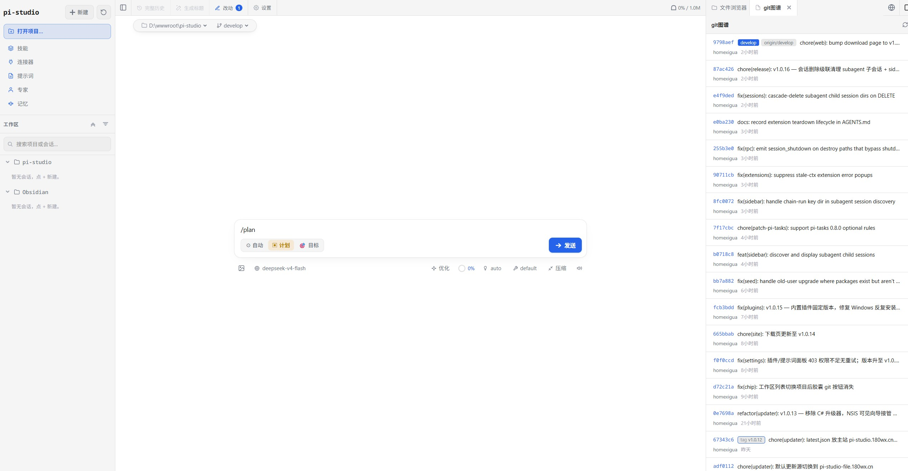
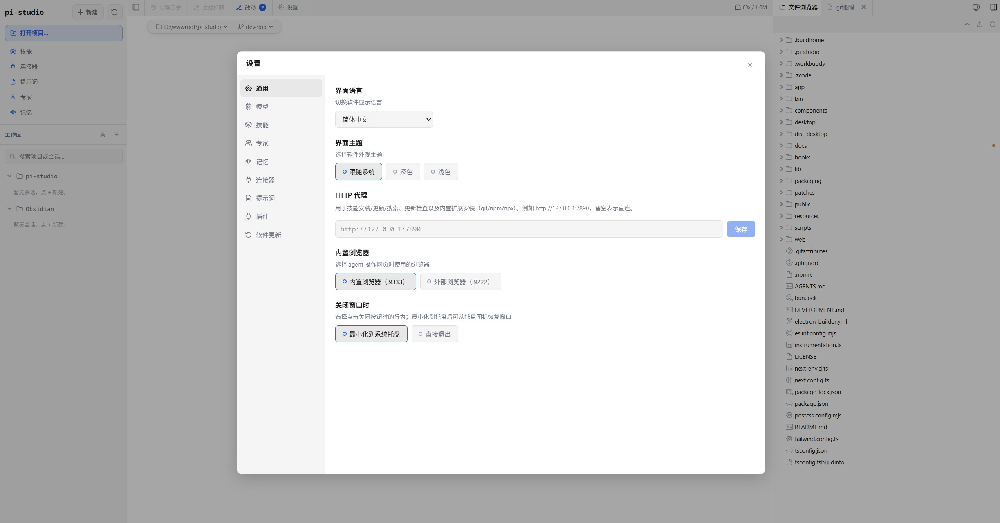

# pi-studio

> [pi coding agent](https://github.com/earendil-works/pi) 的跨平台桌面端 —— 开箱即用，无需配置命令行。

pi-studio 把 **pi agent** 作为 SDK 内嵌、用 **pi web** 提供完整 Web 界面，再由 Electron 封装成桌面应用。它让你在浏览器之外拥有一个常驻窗口：会话浏览、实时对话、模型配置、Skills 管理、文件预览一气呵成。所有数据统一存放在 `~/.pi-studio/`，与 `pi` 命令行（`~/.pi/agent`）隔离互不影响。

## 特性

### 会话与对话

- 📂 **会话管理**：按项目浏览历史会话，无需翻终端历史或 session 路径
- 💬 **实时对话**：流式输出、结构化工具调用、Markdown / Mermaid / KaTeX 渲染
- 🔀 **分叉与分支**：从任意消息分叉新会话，或在同一会话内切换分支
- 🗂️ **多标签页**：会话、文件、Git、浏览器并排开多个标签，随时切换
- 🧭 **会话缩略图**：右侧 minimap 快速跳转长对话，配合完整历史检索
- ❓ **交互卡片**：agent 可发起选择题 / 问卷，界面里直接作答
- ✨ **提示词优化**：一键把随手写的 prompt 改写得更清晰具体
- 📊 **状态可视化**：上下文用量、成本、压缩状态一目了然

### 项目与代码

- 🔧 **Git 集成**：提交历史、变更 diff 查看、界面内直接 commit
- 📁 **文件预览**：源码、图片、音频、PDF、DOCX 在一旁预览
- 🔍 **文件检索**：项目文件名索引，快速定位
- 🔐 **项目信任**：首次打开项目需确认信任，避免误跑陌生代码

### 能力扩展

- ⚙️ **模型配置**：可视化编辑 `models.json`、API key / OAuth 登录、模型连通性测试
- 🧩 **Skills 管理**：搜索、安装、启用/禁用 skills
- 👥 **Experts 专家**：内置 / 包 / 用户 / 项目四级专家，可独立配置模型、工具与技能
- 🧠 **项目记忆**：跨会话保留项目上下文，条目可视化增删
- 🔌 **MCP 连接器**：配置 MCP server，接入外部工具与数据
- 📦 **插件扩展**：安装、更新、启用/禁用 pi 扩展包
- 📝 **提示词库**：管理全局 / 项目级自定义提示词

### 桌面体验

- 🌐 **内置浏览器**：内嵌 webview 标签页，agent 可直接驱动网页（也可切到外部 Chrome）
- 🎨 **主题切换**：明暗主题 + 自定义主题
- 🌍 **多语言界面**：内置多语种切换
- 🖥️ **系统托盘**：最小化到托盘常驻后台
- 🔗 **HTTP 代理**：内置代理配置，适配受限网络
- ⬆️ **自动更新**：检查并安装新版本
- 📱 **响应式布局**：窄窗口自动切换移动端布局
- 🔔 **完成提示音**：agent 完成时播放提示音

## 环境要求

- **开发**：Node.js ≥ 22.19.0
- **运行（安装包）**：无需预装 Node，安装包自带 Node v22.19.0 runtime

## 从源码开发

```bash
git clone <仓库地址>
cd pi-studio
npm install
```

日常开发用热更新（两个终端）：

```bash
# 终端 1：Next dev server
npm run dev

# 终端 2：Electron 壳连到 dev server
npm run desktop:dev
```

更多方式（构建后运行、打包安装包、数据目录说明、常见问题）见 **[DEVELOPMENT.md](./DEVELOPMENT.md)**。

## 打包安装包

```bash
npm run desktop:dist
```

产出在 `dist-desktop/`：

| 平台 | 产物 |
|---|---|
| Windows | `pi-studio-Setup-<version>.exe`（NSIS 安装包） |
| macOS | `.dmg` / `.zip` |
| Linux | `.AppImage` / `.deb` |

## 数据目录

所有 pi agent 数据统一存放在 **`~/.pi-studio/`**（Win: `C:\Users\<你>\.pi-studio`，macOS/Linux: `~/.pi-studio`）：

```
~/.pi-studio/
├── settings.json     # 设置（默认模型、扩展包等）
├── models.json       # 模型配置
├── auth.json         # provider 凭证（API key / OAuth）
├── trust.json        # 项目信任决策
├── sessions/         # 会话文件（.jsonl，按项目 cwd 分目录）
├── skills/           # 全局 skills
├── themes/           # 自定义主题
└── ...
```

- 由 `PI_CODING_AGENT_DIR` 控制，桌面端启动时自动注入。
- 与 `pi` 命令行（`~/.pi/agent`）**数据隔离**，互不影响。
- 全局 skills 的真实文件由外部 `skills` CLI 写到 `~/.pi-studio/skills`，与 SDK 扫描的 `<agentDir>/skills` 天然重合，无需额外配置。

## 界面预览

| 主界面（会话、命令、事件面板） | 设置与文件树 |
|---|---|
|  |  |

## 技术栈

- **Electron** —— 跨平台桌面壳
- **pi web** —— 基于 Next.js 16 + React 19 的完整 Web 界面
- **@earendil-works/pi-coding-agent** —— pi agent SDK，进程内嵌
- **Turbopack** —— 开发期构建

## 项目结构

```
desktop/              Electron 主进程（main / server / preload / 打包脚本）
bin/                  Next server 启动器（桌面端 spawn 它）
app/                  Next.js App Router（页面 + API routes）
components/           React 组件
lib/                  共享逻辑（rpc-manager / session-reader / ...）
hooks/                React hooks
electron-builder.yml  打包配置
DEVELOPMENT.md        开发 / 构建 / 打包指南
AGENTS.md             架构与设计决策备忘
```

## 相关文档

- [开发指南](./DEVELOPMENT.md) —— 本地开发、构建、打包、常见问题
- [架构备忘](./AGENTS.md) —— 关键设计决策与陷阱
- [国际化](./docs/i18n.md) —— 多语言使用与扩展

## 致谢

pi-studio 建立在这两个项目之上：

- **[pi coding agent](https://github.com/earendil-works/pi)** —— agent 内核，以 SDK 形式内嵌，by Mario Zechner
- **[Pi Web](https://github.com/agegr/pi-web)** —— pi 的本地浏览器 UI，本项目的 Web 界面层来源

开箱内置的 pi 扩展（见 `lib/builtin-extension-sources.ts`，版本锁定）：

| 扩展 | 作用 | 仓库 |
|---|---|---|
| `pi-mcp-adapter` | MCP 连接器适配 | [nicobailon/pi-mcp-adapter](https://github.com/nicobailon/pi-mcp-adapter) |
| `pi-subagents` | 子代理委派与多代理编排 | [nicobailon/pi-subagents](https://github.com/nicobailon/pi-subagents) |
| `pi-hermes-memory` | 项目记忆 + 会话检索 + 密钥扫描 | [chandra447/pi-hermes-memory](https://github.com/chandra447/pi-hermes-memory) |
| `@tintinweb/pi-tasks` | 任务追踪与协作 | [tintinweb/pi-tasks](https://github.com/tintinweb/pi-tasks) |
| `@narumitw/pi-plan-mode` | 只读 `/plan` 协作模式 | [narumiruna/pi-extensions](https://github.com/narumiruna/pi-extensions) |
| `@narumitw/pi-goal` | 自主 `/goal` 循环执行 | [narumiruna/pi-extensions](https://github.com/narumiruna/pi-extensions) |
| `@narumitw/pi-chrome-devtools` | CDP 驱动内置浏览器 | [narumiruna/pi-extensions](https://github.com/narumiruna/pi-extensions) |
| `@juicesharp/rpiv-ask-user-question` | 结构化提问 / 问卷卡片 | [juicesharp/rpiv-mono](https://github.com/juicesharp/rpiv-mono) |

## License

MIT
